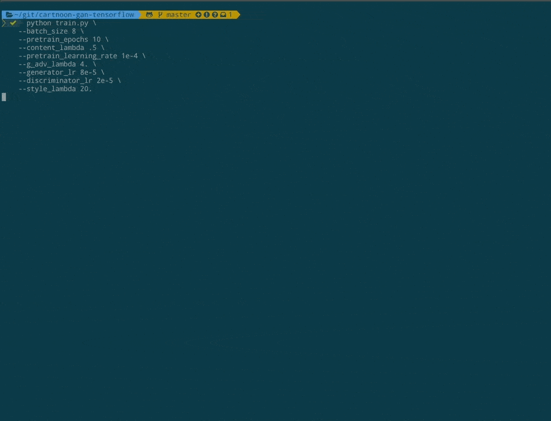
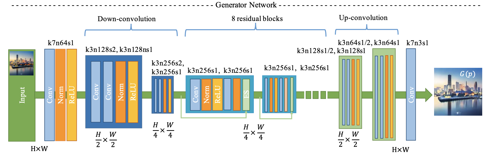
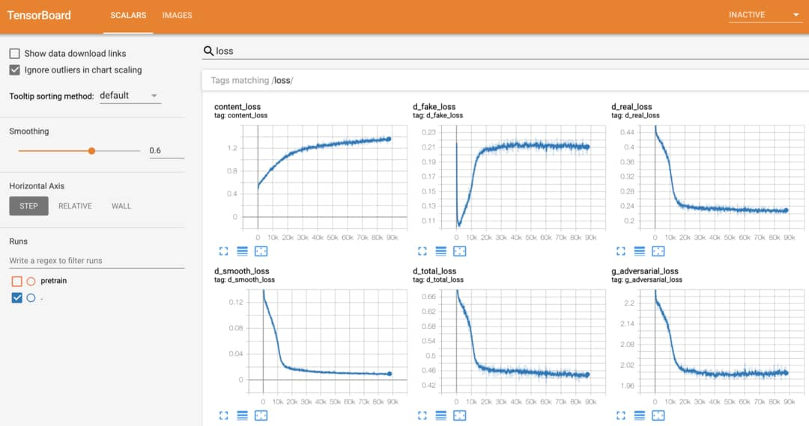
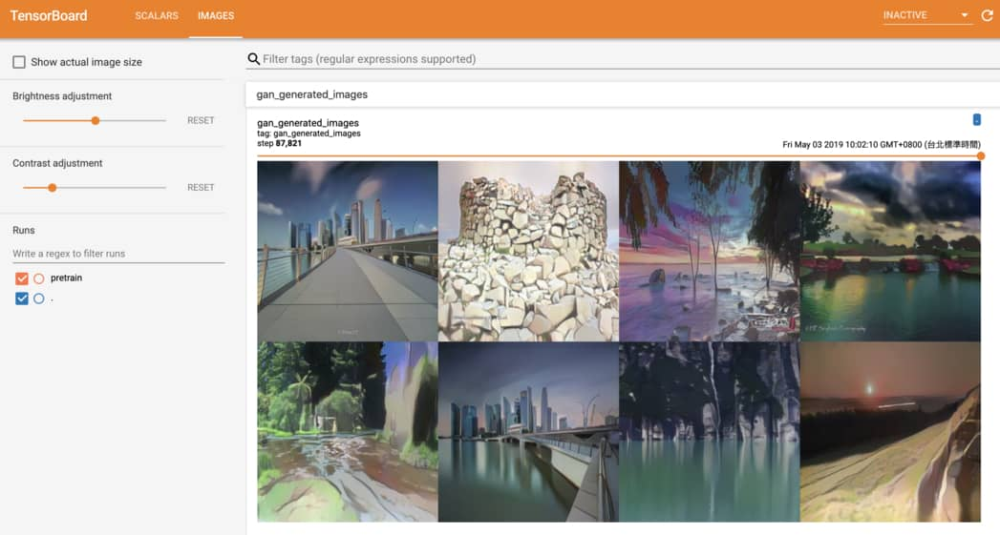
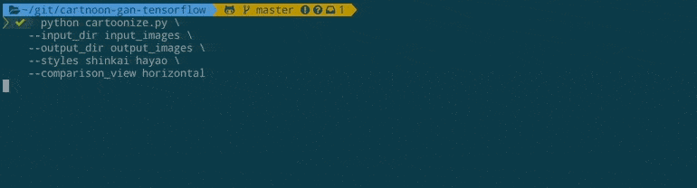
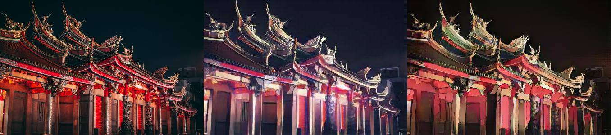
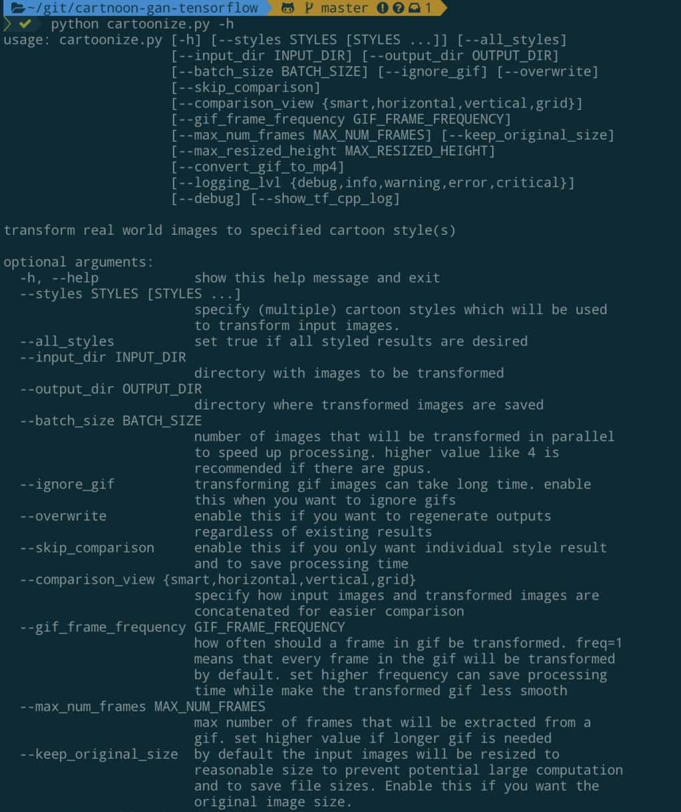

# CartoonGAN-TensorFlow2
Generate your own cartoon-style images with [CartoonGAN (CVPR 2018)](http://openaccess.thecvf.com/content_cvpr_2018/papers/Chen_CartoonGAN_Generative_Adversarial_CVPR_2018_paper.pdf), powered by [TensorFlow 2.0 Alpha](https://www.tensorflow.org/alpha).

Check our blog posts with project overview, online demo and gallery of generated anime: 

| Blog post | Language | 
|-----------|----------|
| [Generate Anime using CartoonGAN and TensorFlow 2.0](https://leemeng.tw/generate-anime-using-cartoongan-and-tensorflow2-en.html) | English |
| [用 CartoonGAN 及 TensorFlow 2 生成新海誠與宮崎駿動畫](https://leemeng.tw/generate-anime-using-cartoongan-and-tensorflow2.html) | 繁體中文（Traditional Chinese）|


Top-left corner is real world image, and the other 3 images are generated by CartoonGAN using different anime styles.

This repo demonstrates how to:
- [Train your own CartoonGAN](#Train-your-own-CartoonGAN)
- [Generate anime using trained CartoonGAN](#generate-anime-using-trained-cartoongan)

## Train your own CartoonGAN

In this section, we will explain how to train a CartoonGAN using the script we provide.

### Setup Environment

First clone this repo:

```bash
git clone https://github.com/mnicnc404/CartoonGan-tensorflow.git
```

To run code in this repo properly, you will need:
- [Python 3.6](https://www.python.org/downloads/release/python-360/)
- [TensorFlow 2.0 Alpha](https://www.tensorflow.org/alpha)
- [tqdm](https://github.com/tqdm/tqdm)
- [imageio](https://pypi.org/project/imageio/)
- [tb-nightly](https://pypi.org/project/tb-nightly/)

For environment management, we recommend [Anaconda](https://www.anaconda.com/). If GPU is available, you can simply install all the packages using:

```bash
conda env create -n cartoongan -f environment_gpu.yml
```

Although it is not recommended to train CartoonGANs without a GPU, you can still set up environment by running:

```bash
conda env create -n cartoongan -f environment_cpu.yml
```

If Anaconda is not available, you can also run:

```bash
pip install -r requirements_gpu.txt
# use `requirements_cpu` if GPU is not available
```

You will also need TensorFlow version of [keras-contrib](https://github.com/keras-team/keras-contrib) for some custom Keras layers used in our CartoonGAN implementation:

```bash
git clone https://www.github.com/keras-team/keras-contrib.git \
    && cd keras-contrib \
    && python convert_to_tf_keras.py \
    && USE_TF_KERAS=1 python setup.py install
```

If all above complete successfully, you're good to go.

### Prepare Dataset

You also need to prepare your own dataset and arrange the images under `datasets` folder as below: 

```text
datasets
└── realworld2cartoon [your dataset name]
    ├── testA [8 real-world images for evaluation]
    ├── trainA [(source) real-world images]
    ├── trainB [(target) cartoon images]
    └── trainB_smooth [cartoon images with smooth edges]
```    

`trainA` and `testA` folders contain real-world images, while `trainB` contain images with desired cartoon style. Notice that 8 images in `testA` folder will be evaluated after each epoch, so they should not appear in `trainA`. In order to generate `trainB_smooth`, you can run [edge_smooth.py](https://github.com/taki0112/CartoonGAN-Tensorflow/blob/master/edge_smooth.py) on `trainB`.


### Start training

Although you may have to tune hyperparameters to generate best result for your own datasets, train following settings that we found effective can be your starting point.

If you get more than 16GB memory in your GPU, you can try these settings:

```bash
python train.py \
    --batch_size 8 \
    --pretrain_epochs 1 \
    --content_lambda .4 \
    --pretrain_learning_rate 2e-4 \
    --g_adv_lambda 8. \
    --generator_lr 8e-5 \
    --discriminator_lr 3e-5 \
    --style_lambda 25. \
    --light \
    --dataset_name {your dataset name}
```

If less GPU memory is available, you can use a smaller `batch_size` and modify all learning rates accordingly. For example, for `batch_size = 4`, you can try:

```bash
python train.py \
    --batch_size 4 \
    --pretrain_epochs 1 \
    --content_lambda .4 \
    --pretrain_learning_rate 1e-4 \
    --g_adv_lambda 8. \
    --generator_lr 4e-5 \
    --discriminator_lr 1.5e-5 \
    --style_lambda 25. \
    --light \
    --dataset_name {your dataset name}
```



Detailed log messages, model architecture and progress bar are all provided. This enable you to gain a better understanding of what is happening when training a CartoonGAN. 

### Choose model architecture

Notice that we specified `--light` in our previous example:

```bash
python train.py \
    ...
    --light \
    ...
```

When specified, [train.py](train.py) will initialize a light-weight [generator](generator.py) for training a CartoonGAN. 

When we design the light-weight generator, [ShuffleNet V2](https://arxiv.org/abs/1807.11164) is taken as a reference. This generator is designed to minimalize inference time while achieving similar effect. We will make some minor adjustments to [discriminator](discriminator.py) as well when `--light` is specified.



Generator proposed by the authors 


To train a CartoonGAN with the original generator/discriminator architecture proposed by the [CartoonGAN](http://openaccess.thecvf.com/content_cvpr_2018/papers/Chen_CartoonGAN_Generative_Adversarial_CVPR_2018_paper.pdf) authors, simply remove `--light` option:

```bash
python train.py \
    --batch_size 8 \
    --pretrain_epochs 1 \
    --content_lambda .4 \
    --pretrain_learning_rate 2e-4 \
    --g_adv_lambda 8. \
    --generator_lr 8e-5 \
    --discriminator_lr 3e-5 \
    --style_lambda 25. \
    --dataset_name {your dataset name}
```

### Monitor your training progress

In our repo, TensorBoard is integrated perfectly so you can monitor model's performance easily by:

```bash
tensorboard --logdir runs
```

After training for awhile, you should be able to see something like this:



In addition to metrics and loss functions, it is good practice to keep an eye on the images generated by GAN during training as well. Using our script, monitoring generated images on TensorBoard is a no-brainer:




For further details about training, we recommend reading [train.py](train.py).


## Generate anime using trained CartoonGAN

In this section, we explain how to generate anime using **trained** CartoonGAN.

If you don't want to train a CartoonGAN yourself (but want to generate anime anyway), you can simply visit [CartoonGAN web demo](https://leemeng.tw/generate-anime-using-cartoongan-and-tensorflow2-en.html) or run [this colab notebook](https://colab.research.google.com/drive/1WIZBHix_cYIGsBKa4phIwCq5qXwO8fRX).

We will describe these methods in details in one minute.

### 3 ways to use CartoonGANs

Basically, there are 3 approachs to generate cartoon-style images in this repo:

| Approach | Description |
| ------------- | ------------- |
| [Cartoonize using TensorFlow.js](#cartoonize-using-tensorflowjs) | Cartoonize images with TensorFlow.js on browser, no setup needed |
| [Cartoonize using Colab Notebook](#cartoonize-using-colab-notebook) | Google Colab let us use free GPUs to cartoonize images faster |
| [Clone this repo and run script](#clone-this-repo-and-run-script) | Suitable for power users and those who want to make this repo better :) |

You can start with preferred approach or watch the demos first (shown below).

### [Cartoonize using TensorFlow.js](https://leemeng.tw/generate-anime-using-cartoongan-and-tensorflow2-en.html)

This is by far the easiest way to interact with the CartoonGAN. Just visit our [blog post with web demo](https://leemeng.tw/generate-anime-using-cartoongan-and-tensorflow2-en.html) and upload your images:


You can right-click on the result to save it.

Under the hood, the webpage utilize [TensorFlow.js](https://www.tensorflow.org/js) to load the pretrained models and transform your images. However, due to the computation limits of the browsers, this approach currently only support static and relatively small images. If you want to transform gifs, keep reading.

### [Cartoonize using Colab Notebook](https://colab.research.google.com/drive/1WIZBHix_cYIGsBKa4phIwCq5qXwO8fRX) 

The most exciting thing is to cartoonize existing gifs. We created a [Colab notebook](https://colab.research.google.com/drive/1WIZBHix_cYIGsBKa4phIwCq5qXwO8fRX) which set up everything including [TensorFlow 2.0](https://www.tensorflow.org/alpha) for you to achieve that:


You got the idea. Try cartoonizing your favorite images using styles available in [the notebook](https://colab.research.google.com/drive/1WIZBHix_cYIGsBKa4phIwCq5qXwO8fRX).

### Clone this repo and run script

This method is handy if you already clone the repo and set up the environment.

Currently, there are 4 styles available:
- `shinkai`
- `hayao`
- `hosoda`
- `paprika`

For demo purpose, let's assume we want to transform [input_images/temple.jpg](input_images/temple.jpg):


To cartoonize this image with `shinkai` and `hayao` styles, you can run:

```commandline
python cartoonize.py \
    --input_dir input_images \
    --output_dir output_images \
    --styles shinkai hayao \
    --comparison_view horizontal
```



The transformed result will be saved as [output_images/comparison/temple.jpg](output_images/comparison/temple.jpg) like this:



The left-most image will be the original image, followed by the styled result specified using `--styles` option.

To explore all options with detailed explaination, simply run `python cartoonize.py -h`:




### Gallery of Generated Anime

If you want to view more anime generated by CartoonGAN, please visit the blog article with language you prefer:

| Blog post | Language | 
|-----------|----------|
| [Generate Anime using CartoonGAN and TensorFlow 2.0](https://leemeng.tw/generate-anime-using-cartoongan-and-tensorflow2-en.html#Gallery:-some-anime-we-generated) | English |
| [用 CartoonGAN 及 TensorFlow 2 生成新海誠與宮崎駿動畫](https://leemeng.tw/generate-anime-using-cartoongan-and-tensorflow2.html#%E4%B8%80%E4%BA%9B%E8%BD%89%E6%8F%9B%E5%BE%8C%E7%9A%84%E5%8B%95%E6%BC%AB%E7%B5%90%E6%9E%9C) | 繁體中文（Traditional Chinese）|

## Acknowledgement
- Thanks to the author `[Chen et al., CVPR18]` who published this great work
- [CartoonGAN-Test-Pytorch-Torch](https://github.com/Yijunmaverick/CartoonGAN-Test-Pytorch-Torch) where we extracted pretrained Pytorch model weights for TensorFlow usage
- [TensorFlow](https://www.tensorflow.org/) which provide many useful tutorials for learning TensorFlow 2.0:
    - [Deep Convolutional Generative Adversarial Network](https://www.tensorflow.org/alpha/tutorials/generative/dcgan)
    - [Build a Image Input Pipeline](https://www.tensorflow.org/alpha/tutorials/load_data/images)
    - [Get started with TensorBoard](https://www.tensorflow.org/tensorboard/r2/get_started)
    - [Custom layers](https://www.tensorflow.org/tutorials/eager/custom_layers)
- [Google Colaboratory](https://colab.research.google.com/) which allow us to train the models and [cartoonize images](#cartoonize-using-colab-notebook) using free GPUs
- [TensorFlow.js](https://www.tensorflow.org/js) team which help us a lot when building the [online demo](https://leemeng.tw/generate-anime-using-cartoongan-and-tensorflow2-en.html) for CartoonGAN
- [taki0112/CartoonGAN-Tensorflow](https://github.com/taki0112/CartoonGAN-Tensorflow) where we modify [edge_smooth.py](https://github.com/taki0112/CartoonGAN-Tensorflow/blob/master/edge_smooth.py) to fit our needs 
