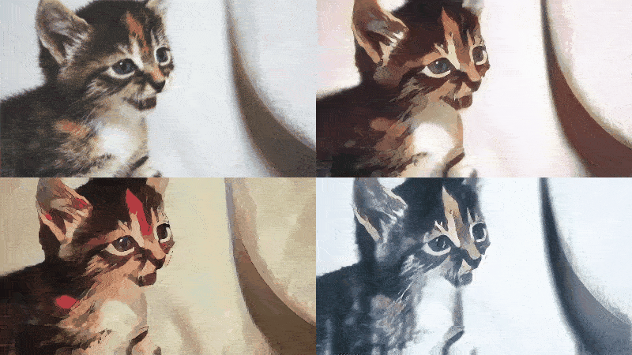
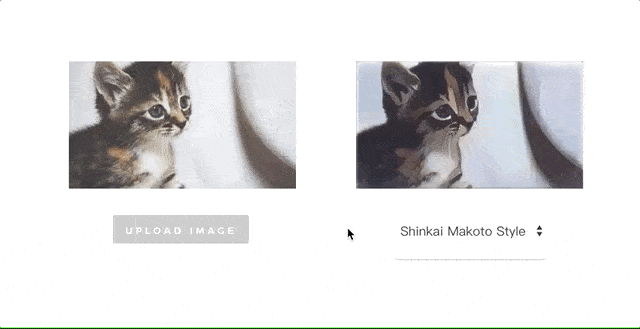
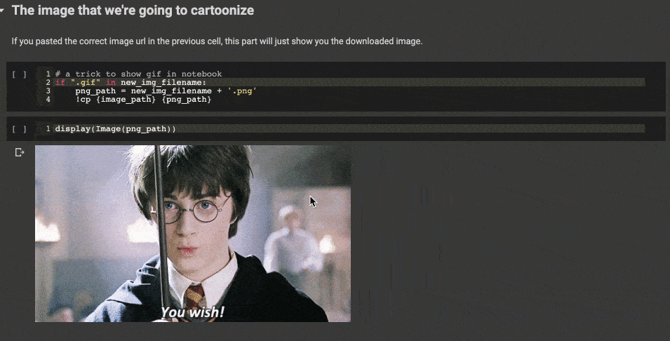

# CartoonGAN-TensorFlow2
Generate your own cartoon-style images with [CartoonGAN (CVPR 2018)](http://openaccess.thecvf.com/content_cvpr_2018/papers/Chen_CartoonGAN_Generative_Adversarial_CVPR_2018_paper.pdf), powered by [TensorFlow 2.0 Alpha](https://www.tensorflow.org/alpha).



Top-left part of the gif is the original input image, while all other 3 parts are cartoonized from it using different styles.

This repo demonstrate how you can generate cartoon-style images by:
- visiting the [CartoonGAN web demo](https://leemeng.tw/drafts/generate-anime-using-cartoongan-and-tensorflow.html) 
- executing provided [Python script](cartoonize.py) like this:

```bash
python cartoonize.py --styles shinkai hayao hosoda
```

When executed, [cartoonize.py](cartoonize.py) will load pretrained models released by the [author](http://cg.cs.tsinghua.edu.cn/people/~Yongjin/Yongjin.htm) of CartoonGAN and [CartoonGAN-Test-Pytorch-Torch](https://github.com/Yijunmaverick/CartoonGAN-Test-Pytorch-Torch) to turn your original images into cartoon-like images. 

## Cartoonize first, Train later

This repo first focus on how you can **actually use** [CartoonGAN](http://openaccess.thecvf.com/content_cvpr_2018/papers/Chen_CartoonGAN_Generative_Adversarial_CVPR_2018_paper.pdf) to cartoonize images. 

For those who want to **train** their own CartoonGANs or to understand how to train a [GAN](https://en.wikipedia.org/wiki/Generative_adversarial_network) using latest version of [TensorFlow](https://www.tensorflow.org/), training code implemented completely in [TensorFlow 2.0](https://www.tensorflow.org/alpha) are also provided for reference. See [Train your own models](#train-your-own-models) for more details.

## Getting Started

Basically, there are 3 approachs to generate cartoon-style images in this repo:

| Approach | Description |
| ------------- | ------------- |
| 1. [Cartoonize using TensorFlow.js](#cartoonize-using-tensorFlow.js) | Cartoonize images with TensorFlow.js on browser, no setup needed |
| 2. [Cartoonize using Colab Notebook](#cartoonize-using-colab-notebook) | Google Colab let us use free GPUs to cartoonize images faster |
| 3. [Clone this repo and run script](#clone-this-repo-and-run-script) | Suitable for power users and those who want to make this repo better :) |

You can start with preferred approach or just watch demos shown below.

## [Cartoonize using TensorFlow.js](https://leemeng.tw/drafts/generate-anime-using-cartoongan-and-tensorflow.html)

This is by far the easiest way to interact with the CartoonGAN. Just visit the [web demo](https://leemeng.tw/drafts/generate-anime-using-cartoongan-and-tensorflow.html) and upload your images:



You can right-click on the result to save it.

Under the hood, the webpage utilize [TensorFlow.js](https://www.tensorflow.org/js) to load the pretrained models and transform your images. However, due to the computation limits of the browsers, this approach currently only support static and relatively small images. If you want to transform gifs, keep reading.

## [Cartoonize using Colab Notebook](https://colab.research.google.com/drive/1WIZBHix_cYIGsBKa4phIwCq5qXwO8fRX) 

The most exciting thing is to cartoonize existing gifs. We created a [Colab notebook](https://colab.research.google.com/drive/1WIZBHix_cYIGsBKa4phIwCq5qXwO8fRX) which set up everything including [TensorFlow 2.0](https://www.tensorflow.org/alpha) for you to achieve that:



You got the idea. Try cartoonizing your favorite images using styles available in [the notebook](https://colab.research.google.com/drive/1WIZBHix_cYIGsBKa4phIwCq5qXwO8fRX).

## Clone this repo and run script

### Setup

### Example usage


## [TODO] Train your own models

## [TODO] Gallery

## Acknowledgement
- Thanks to the author `[Chen et al., CVPR18]` who published this great work
- [CartoonGAN-Test-Pytorch-Torch](https://github.com/Yijunmaverick/CartoonGAN-Test-Pytorch-Torch) where we extracted pretrained Pytorch model weights for TensorFlow usage
- [TensorFlow](https://www.tensorflow.org/) which provide many useful tutorials for learning TensorFlow 2.0:
    - [Deep Convolutional Generative Adversarial Network](https://www.tensorflow.org/alpha/tutorials/generative/dcgan)
    - [Build a Image Input Pipeline](https://www.tensorflow.org/alpha/tutorials/load_data/images)
    - [Get started with TensorBoard](https://www.tensorflow.org/tensorboard/r2/get_started)
    - [Custom layers](https://www.tensorflow.org/tutorials/eager/custom_layers)
- [Google Colaboratory](https://colab.research.google.com/) which allow us to train the models and cartoonize images using free GPUs as shown in [Cartoonize using Colab Notebook](#cartoonize-using-colab-notebook)
- [TensorFlow.js](https://www.tensorflow.org/js) team which help us a lot when building the [online demo](https://leemeng.tw/drafts/generate-anime-using-cartoongan-and-tensorflow.html) for CartoonGAN
